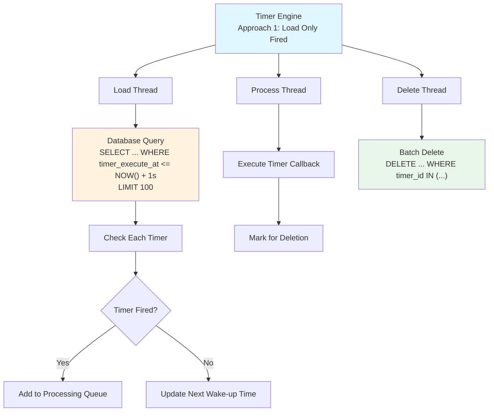

# Timer Engine Design

## Overview

This document outlines the design for a timer engine that manages timer execution within a single shard owned by a service instance. The engine is responsible for reading timers from the database, processing them when they fire, and efficiently cleaning up completed timers.

## Design Scope

**Scope**: Single shard timer processing within one service instance
**Responsibilities**:
- Read/load timers from database
- Process timers when they fire (execute callbacks)
- Delete completed timers efficiently
- Handle new timer additions during processing

## Core Design Challenges

1. **Efficiency vs Accuracy**: Balance between database query frequency and timer precision
2. **Memory Management**: Control memory usage for loaded fired timers
3. **Consistency**: Handle concurrent timer additions during processing windows
4. **Batch Operations**: Optimize database operations for high throughput
5. **Fault Tolerance**: Ensure no timer loss during failures
6. **Cache Consistency**: Avoid complex caching mechanisms that introduce race conditions with timer updates/deletions

## ⚠️ **Important Note: Pseudo-Code Implementation**

**The Go code blocks in this document are simplified pseudo-code examples designed to illustrate the core concepts and logic flow.** The actual production implementation will be significantly more complex.

---

## Approach 1: Load Only Fired Timers + Look-Ahead (Recommended)

### Design Overview

**Strategy**: Minimal memory usage with dynamic look-ahead scheduling
**Key Principle**: Load only timers that have already fired, plus look-ahead for next wake-up time

### Architecture Components



### Detailed Workflow

#### Loading Phase
```sql
-- Query Pattern: Load fired timers + 1s look-ahead
SELECT * FROM timers 
WHERE shard_id = ? AND row_type = 2 
  AND timer_execute_at <= (NOW() + INTERVAL 1 SECOND)
ORDER BY timer_execute_at ASC 
LIMIT 100;
```

#### Processing Logic

**Engine Structure**: The Approach1Engine maintains minimal state for the "load only fired timers" strategy. It tracks the load interval (how often to check for timers), a small look-ahead window (1 second), channels for processing and deletion, and manages dynamic wake-up scheduling based on the next timer to fire.

```go
type Approach1Engine struct {
    loadInterval     time.Duration  // Default: 5s, Dynamic: 1s-30s
    lookAheadWindow  time.Duration  // Fixed: 1s
    processingQueue  chan Timer
    deletionQueue    chan []TimerID
    nextWakeUp       time.Time
    loadTimer        *time.Timer    // Current scheduled load timer
}

// **Timer Loading Logic**: This function implements the core "load only fired timers" strategy with adaptive wake-up scheduling. It queries the database for timers within a 1-second look-ahead window, immediately queues any fired timers for processing, and dynamically schedules the next load based on the earliest future timer found (or falls back to the default interval if no future timers exist).

func (e *Approach1Engine) LoadTimers() {
    now := time.Now()
    lookAhead := now.Add(e.lookAheadWindow)
    
    timers := e.db.GetTimersUpToTimestamp(e.shardID, lookAhead)
    
    nextWakeUp := now.Add(e.loadInterval) // Default fallback
    
    for _, timer := range timers {
        if timer.ExecuteAt.Before(now) {
            // Timer has fired - add to processing queue
            e.processingQueue <- timer
        } else {
            // Future timer - update next wake-up time
            if timer.ExecuteAt.Before(nextWakeUp) {
                nextWakeUp = timer.ExecuteAt
            }
        }
    }
    
    e.scheduleNextLoad(nextWakeUp)
}

// **Dynamic Timer Addition**: This function handles new timer creation with intelligent wake-up management. It first persists the timer to the database for durability, then optimizes the engine's scheduling by immediately processing already-fired timers or updating the wake-up time if the new timer should fire before the currently scheduled load. This ensures responsive timer execution without unnecessary database polling.

func (e *Approach1Engine) AddTimer(timer Timer) error {
    // Write timer to database first
    err := e.db.CreateTimer(timer)
    if err != nil {
        return err
    }
    
    // Check if this timer should update our wake-up time
    now := time.Now()
    
    if timer.ExecuteAt.Before(now) {
        // Timer has already fired - add directly to processing queue
        e.processingQueue <- timer
    } else if timer.ExecuteAt.Before(e.nextWakeUp) {
        // Timer fires before our next scheduled wake-up
        // Update wake-up time to fire earlier
        e.scheduleNextLoad(timer.ExecuteAt)
        
    }
    // If timer fires after nextWakeUp, no action needed - it will be picked up in the next regular load
    
    return nil
}
```

### Memory and Performance Characteristics

**Memory Usage**: 
- **Low**: Only fired timers in memory (~100-1000 timers)
- **Dynamic**: Scales with firing rate, not total timer count

**Database Load**:
- **Read Frequency**: Variable (1s - 30s intervals)
- **Read Size**: Small batches (100-1000 timers)
- **Delete Frequency**: Batched every 30-60s
- **Delete Size**: Large batches (1000-10000 timers)

### Example Timeline

```
Time: 10:00:00 - Load timers up to 10:00:01
├── Found: Timer A (10:00:00) → Add to processing queue
├── Found: Timer B (10:00:00.5) → Add to processing queue  
├── Found: Timer C (10:00:00.8) → Add to processing queue
└── Found: Timer D (10:00:00.9) → Add to processing queue
    Next timer: Timer E (10:00:02) → Schedule wake-up at 10:00:02

Time: 10:00:02 - Load timers up to 10:00:03
├── Found: Timer E (10:00:02) → Add to processing queue
└── No future timers → Schedule wake-up at 10:00:07 (default interval)

Time: 10:00:07 - Load timers up to 10:00:08
└── No timers found → Schedule wake-up at 10:00:12

Time: 10:00:08 - New timer added (executeAt: 10:00:10)
├── Write to database: SUCCESS
├── Current nextWakeUp: 10:00:12
├── New timer fires before nextWakeUp → Update wake-up time
└── New scheduled wake-up: 10:00:10

Time: 10:00:09 - New timer added (executeAt: 10:00:15)
├── Write to database: SUCCESS  
├── Current nextWakeUp: 10:00:10
├── New timer fires after nextWakeUp → No change needed
└── Will be picked up in next regular load cycle

Time: 10:00:10 - Load timers up to 10:00:11 (triggered by AddTimer)
├── Found: Timer F (10:00:10) → Add to processing queue
└── Next timer: Timer G (10:00:15) → Schedule wake-up at 10:00:15
```

### Advantages and Disadvantages

**✅ Advantages:**
- **Low Memory Usage**: Minimal memory footprint
- **Simple Logic**: Straightforward implementation
- **Batch Deletion**: Efficient database cleanup
- **Adaptive**: Optimized for sparse timers, or very dense timer distribution

**❌ Disadvantages:**
- **Higher Database Read Frequency**: More frequent small queries compared to preloading approaches
- **Wake-up Overhead**: Requires more wake-ups for evenly distributed timers (e.g., one query per second for one timer per second)

### Optimizations for Production

To maximize the efficiency of this approach in production:

#### 1. **Intelligent Batching**
- Batch process multiple fired timers in each processing cycle
- Accumulate timers for batch deletion (delete every 30-60 seconds)
- Use appropriate database connection pooling and query optimization

#### 2. **Adaptive Scheduling**
- Dynamically adjust load intervals based on timer density patterns
- Use exponential backoff when no timers are found
- Implement smart wake-up scheduling based on known future timers

#### 3. **Database Optimizations**
- Ensure proper indexing on (shard_id, row_type, timer_execute_at)
- Use database-specific optimizations for timestamp-based queries
- Consider read replicas for timer loading to reduce load on primary database

#### 4. **Memory Management**
- Keep fired timers in memory only until successful callback execution
- Implement bounded queues to prevent memory issues during processing delays
- Monitor memory usage and processing queue depths 

---


## Recommended Implementation: Approach 1 (Load Only Fired Timers)

**Rationale**: 
After careful consideration of implementation complexity and operational challenges, we have decided to implement **Approach 1: Load Only Fired Timers + Look-Ahead** as our timer engine strategy.

### Why Not Preload Future Timers?

While preloading future timers (the previously considered Approach 2) offered theoretical efficiency gains, it introduced several critical challenges that make it impractical for production use:

#### 1. **Unpredictable Memory Consumption**
- After preloading timers for a 2-minute window, new timers can be inserted at any time within that range
- Memory usage becomes unpredictable and can grow unboundedly during high timer creation periods
- Any memory pressure mitigation (unloading timers) would eliminate the benefits of range deletion
- This creates an unsolvable trade-off between memory control and efficiency gains

#### 2. **Complex Cache Consistency Issues**
- Preloaded timers create an in-memory cache that must stay synchronized with database updates
- Timer updates and deletions require complex coordination between memory and database state
- Race conditions between timer modifications and in-memory processing become numerous and difficult to handle
- Cache invalidation strategies add significant complexity without clear benefit

#### 3. **Shard Movement Edge Cases**
- Shard ownership changes introduce eventual consistency challenges
- Preloaded timers from previous shard owners create ambiguous ownership scenarios
- Coordination between old and new shard owners becomes complex and error-prone
- The distributed nature of the system makes these edge cases particularly challenging

#### 4. **Operational Complexity**
- Memory tuning and monitoring requirements increase operational burden
- Debugging becomes significantly more complex with dual state (memory + database)
- Performance characteristics become less predictable due to memory pressure interactions

### Benefits of the Chosen Approach

**Approach 1: Load Only Fired Timers** provides:

- **Simplicity**: Straightforward implementation with minimal state management
- **Predictable Memory Usage**: Only fired timers in memory, scales with execution rate not timer density
- **No Cache Consistency**: Single source of truth (database) eliminates synchronization issues
- **Robust Fault Tolerance**: Simple recovery model with no complex state reconstruction
- **Operational Simplicity**: Predictable performance characteristics and easier debugging
- **Sufficient Performance**: While not theoretically optimal, provides adequate performance for our scale

### Performance Trade-offs

While this approach may require more frequent database reads compared to preloading, the benefits of simplicity, correctness, and operational ease outweigh the theoretical efficiency gains of a more complex caching approach.

The system can still achieve high performance through:
- Efficient batch deletion of completed timers
- Adaptive wake-up scheduling based on timer density
- Optimized database queries with appropriate indexing
- Horizontal scaling across multiple shards
