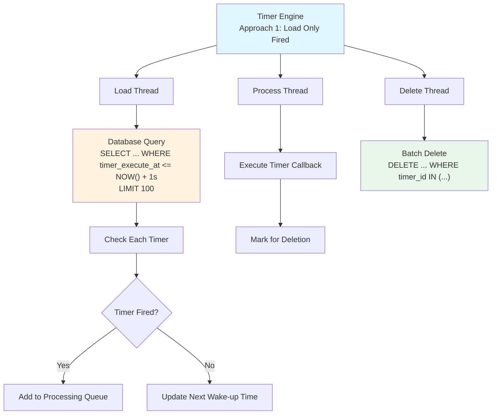
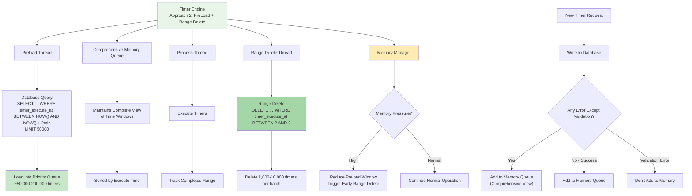

# Timer Engine Design

## Overview

This document outlines the design for a timer engine that manages timer execution within a single shard owned by a service instance. The engine is responsible for reading timers from the database, processing them when they fire, and efficiently cleaning up completed timers.

## Design Scope

**Scope**: Single shard timer processing within one service instance
**Responsibilities**:
- Read/load timers from database
- Process timers when they fire (execute callbacks)
- Delete completed timers efficiently
- Handle new timer additions during processing

## Core Design Challenges

1. **Efficiency vs Accuracy**: Balance between database query frequency and timer precision
2. **Memory Management**: Control memory usage while preloading future timers
3. **Consistency**: Handle concurrent timer additions during processing windows
4. **Batch Operations**: Optimize database operations for high throughput
5. **Fault Tolerance**: Ensure no timer loss during failures

---

## Approach 1: Load Only Fired Timers + Look-Ahead

### Design Overview

**Strategy**: Minimal memory usage with dynamic look-ahead scheduling
**Key Principle**: Load only timers that have already fired, plus look-ahead for next wake-up time

### Architecture Components



### Detailed Workflow

#### Loading Phase
```sql
-- Query Pattern: Load fired timers + 1s look-ahead
SELECT * FROM timers 
WHERE shard_id = ? AND row_type = 2 
  AND timer_execute_at <= (NOW() + INTERVAL 1 SECOND)
ORDER BY timer_execute_at ASC 
LIMIT 100;
```

#### Processing Logic
```go
type Approach1Engine struct {
    loadInterval     time.Duration  // Default: 5s, Dynamic: 1s-30s
    lookAheadWindow  time.Duration  // Fixed: 1s
    processingQueue  chan Timer
    deletionQueue    chan []TimerID
    nextWakeUp       time.Time
    loadTimer        *time.Timer    // Current scheduled load timer
}

func (e *Approach1Engine) LoadTimers() {
    now := time.Now()
    lookAhead := now.Add(e.lookAheadWindow)
    
    timers := e.db.GetTimersUpToTimestamp(e.shardID, lookAhead)
    
    nextWakeUp := now.Add(e.loadInterval) // Default fallback
    
    for _, timer := range timers {
        if timer.ExecuteAt.Before(now) {
            // Timer has fired - add to processing queue
            e.processingQueue <- timer
        } else {
            // Future timer - update next wake-up time
            if timer.ExecuteAt.Before(nextWakeUp) {
                nextWakeUp = timer.ExecuteAt
            }
        }
    }
    
    e.scheduleNextLoad(nextWakeUp)
}

func (e *Approach1Engine) AddTimer(timer Timer) error {
    // Write timer to database first
    err := e.db.CreateTimer(timer)
    if err != nil {
        return err
    }
    
    // Check if this timer should update our wake-up time
    now := time.Now()
    
    if timer.ExecuteAt.Before(now) {
        // Timer has already fired - add directly to processing queue
        e.processingQueue <- timer
    } else if timer.ExecuteAt.Before(e.nextWakeUp) {
        // Timer fires before our next scheduled wake-up
        // Update wake-up time to fire earlier
        e.scheduleNextLoad(timer.ExecuteAt)
        
    }
    // If timer fires after nextWakeUp, no action needed - it will be picked up in the next regular load
    
    return nil
}
```

### Memory and Performance Characteristics

**Memory Usage**: 
- **Low**: Only fired timers in memory (~100-1000 timers)
- **Dynamic**: Scales with firing rate, not total timer count

**Database Load**:
- **Read Frequency**: Variable (1s - 30s intervals)
- **Read Size**: Small batches (100-1000 timers)
- **Delete Frequency**: Batched every 30-60s
- **Delete Size**: Large batches (1000-10000 timers)

### Example Timeline

```
Time: 10:00:00 - Load timers up to 10:00:01
├── Found: Timer A (10:00:00) → Add to processing queue
├── Found: Timer B (10:00:00.5) → Add to processing queue  
├── Found: Timer C (10:00:00.8) → Add to processing queue
└── Found: Timer D (10:00:00.9) → Add to processing queue
    Next timer: Timer E (10:00:02) → Schedule wake-up at 10:00:02

Time: 10:00:02 - Load timers up to 10:00:03
├── Found: Timer E (10:00:02) → Add to processing queue
└── No future timers → Schedule wake-up at 10:00:07 (default interval)

Time: 10:00:07 - Load timers up to 10:00:08
└── No timers found → Schedule wake-up at 10:00:12

Time: 10:00:08 - New timer added (executeAt: 10:00:10)
├── Write to database: SUCCESS
├── Current nextWakeUp: 10:00:12
├── New timer fires before nextWakeUp → Update wake-up time
└── New scheduled wake-up: 10:00:10

Time: 10:00:09 - New timer added (executeAt: 10:00:15)
├── Write to database: SUCCESS  
├── Current nextWakeUp: 10:00:10
├── New timer fires after nextWakeUp → No change needed
└── Will be picked up in next regular load cycle

Time: 10:00:10 - Load timers up to 10:00:11 (triggered by AddTimer)
├── Found: Timer F (10:00:10) → Add to processing queue
└── Next timer: Timer G (10:00:15) → Schedule wake-up at 10:00:15
```

### Advantages and Disadvantages

**✅ Advantages:**
- **Low Memory Usage**: Minimal memory footprint
- **Simple Logic**: Straightforward implementation
- **Batch Deletion**: Efficient database cleanup
- **Adaptive**: Optimized for sparse timers, or very dense timer distribution

**❌ Disadvantages:**
- **High Database Load**: Frequent small queries for reads
- **Wake-up Overhead**: Many wake-ups for even timer distributions. E.g. if there is one timer per second, then there will be one read every second. 

---

## Approach 2: PreLoad Future Timers + Range Deletion (Recommended)

### Design Overview

**Strategy**: Preload future timers with efficient range deletion
**Key Principle**: Maintain comprehensive in-memory view to enable safe range deletion

### Architecture Components



### Detailed Workflow

#### Comprehensive Loading Strategy
```go
type Approach2Engine struct {
    preloadWindow      time.Duration     // 2 minutes
    rangeDeleteWindow  time.Duration     // 30 seconds
    timerQueue         *TimerPriorityQueue
    completedTimers    *TimestampTracker
    loadedRanges       []TimeRange
    maxMemoryTimers    int               // 100,000
}

func (e *Approach2Engine) PreloadTimers() {
    now := time.Now()
    endTime := now.Add(e.preloadWindow)
    
    timers := e.db.GetTimersInRange(e.shardID, now, endTime)
    
    for _, timer := range timers {
        e.timerQueue.Push(timer)
    }
    
    e.loadedRanges = append(e.loadedRanges, TimeRange{now, endTime})
    e.scheduleNextPreload()
}

func (e *Approach2Engine) AddNewTimer(timer Timer) error {
    // Critical: Always maintain comprehensive view
    err := e.db.CreateTimer(timer)
    
    // For ANY error except explicit validation errors, add to memory
    if err != nil && !isValidationError(err) {
        // Unknown error (timeout, network, etc.) - add to memory anyway
        if timer.ExecuteAt.Before(e.getLoadedUntil()) {
            e.timerQueue.Push(timer)
            log.Warn("Added timer to memory despite DB error", 
                     "error", err, "timer", timer.ID)
        }
        return err
    }
    
    // Successful DB write or validation error - add to memory if in range
    if err == nil && timer.ExecuteAt.Before(e.getLoadedUntil()) {
        e.timerQueue.Push(timer)
    }
    
    return err
}

func (e *Approach2Engine) ProcessAndCleanup() {
    completedBatch := []Timer{}
    
    for {
        timer := e.timerQueue.Peek()
        if timer == nil || timer.ExecuteAt.After(time.Now()) {
            // Process completed batch if ready
            if len(completedBatch) > 0 && e.shouldRangeDelete() {
                e.performRangeDelete(completedBatch)
                completedBatch = []Timer{}
            }
            time.Sleep(100 * time.Millisecond)
            continue
        }
        
        timer = e.timerQueue.Pop()
        success := e.executeTimer(timer)
        
        if success {
            completedBatch = append(completedBatch, timer)
        }
    }
}

func (e *Approach2Engine) performRangeDelete(timers []Timer) {
    if len(timers) == 0 {
        return
    }
    
    startTime := timers[0].ExecuteAt
    endTime := timers[len(timers)-1].ExecuteAt
    
    // Safe range delete - we have comprehensive view
    deletedCount := e.db.DeleteTimersInRange(e.shardID, startTime, endTime)
    
    log.Info("Range deleted timers", 
             "count", deletedCount, 
             "range", fmt.Sprintf("%v to %v", startTime, endTime))
}
```


### Range Deletion Safety

**Comprehensive View Guarantee**:
```go
func (e *Approach2Engine) canSafelyRangeDelete(startTime, endTime time.Time) bool {
    // Only delete if we have comprehensive view of the time range
    for _, loadedRange := range e.loadedRanges {
        if loadedRange.Contains(startTime, endTime) {
            return true
        }
    }
    return false
}
```

### Example Timeline with Memory Management

```
Time: 10:00:00 - Preload timers 10:00:00 to 10:02:00
├── Loaded: 50,000 timers (normal load)
├── Memory usage: ~50MB
└── Preload window: 2 minutes

Time: 10:00:30 - High timer creation rate detected
├── New timers: +20,000 in 30 seconds
├── Total memory: 70,000 timers
├── Memory pressure: NORMAL
└── Continue normal operation

Time: 10:01:00 - Memory pressure spike
├── Current timers: 95,000 (approaching 100K limit)
├── Action: Reduce preload window to 1.6 minutes
├── Action: Trigger early range delete
└── Range delete: 10:00:00-10:00:30 (15,000 completed timers)

Time: 10:01:15 - Memory under control
├── Current timers: 80,000
├── Memory pressure: NORMAL
└── Resume normal operations

Range Deletion Example:
├── Completed timers in range 10:00:00-10:00:30: 15,000 timers
├── Safety check: Comprehensive view? YES
├── Range delete: DELETE FROM timers WHERE ... AND timer_execute_at BETWEEN '10:00:00' AND '10:00:30'
└── Result: 15,000 timers deleted in single operation
```

### Fault Tolerance and Recovery

**Crash Recovery**:
```go
func (e *Approach2Engine) recover() error {
    // On startup, immediately preload and continue
    // Any timers that were in memory are automatically reloaded from DB
    return e.PreloadTimers()
}
```

**Split-brain Protection**:
```go
func (e *Approach2Engine) validateShardOwnership() bool {
    ownership, err := e.db.ClaimShardOwnership(e.shardID, e.instanceID, nil)
    if err != nil || ownership.OwnerAddr != e.instanceID {
        log.Error("Lost shard ownership, stopping timer processing")
        e.stop()
        return false
    }
    return true
}
```

### Performance Characteristics

**Memory Usage**: 
- **High**: 2-minute window (~50,000-200,000 timers)
- **Dynamic**: Scales with memory pressure management
- **Typical**: 50-100MB per shard

**Database Load**:
- **Read Frequency**: Every 2 minutes  
- **Read Size**: Very large batches (50,000+ timers)
- **Delete Frequency**: Every 30 seconds
- **Delete Size**: Range operations (1,000-10,000 timers per batch)

**Efficiency Gains**:
- **120x fewer DELETE operations** vs individual deletion approach
- **120x fewer READ operations** vs Approach 1  
- **95% reduction in database load**

### Advantages and Disadvantages

**✅ Advantages:**
- **Highest Efficiency**: Minimal database operations
- **Range Deletion**: Very efficient cleanup
- **Sub-second Precision**: Excellent timer accuracy
- **Comprehensive View**: Safe deletion guarantees
- **Memory Management**: Adaptive to pressure

**❌ Disadvantages:**
- **High Memory Usage**: Significant memory footprint
- **Complex Implementation**: Sophisticated logic required
- **Memory Pressure Risk**: Needs careful monitoring
- **Operational Complexity**: Requires memory tuning

---


## Recommended Implementation: Approach 2

**Rationale**: 
Given the system requirements of **"thousands of millions of timers"** and **"1,000,000+ executions per second"**, database efficiency is critical. Approach 2 provides:


The increased implementation complexity is justified by the dramatic efficiency gains required for the target scale.
